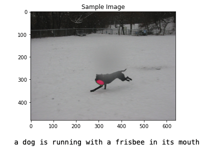
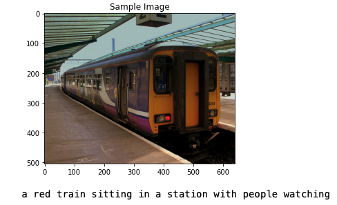
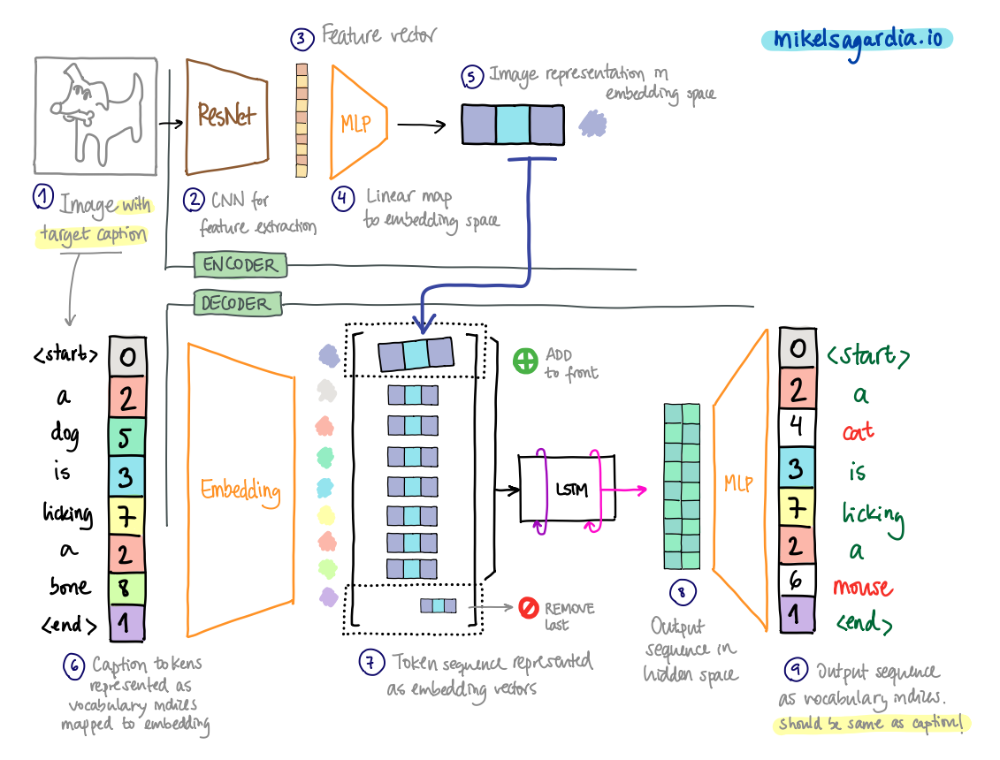
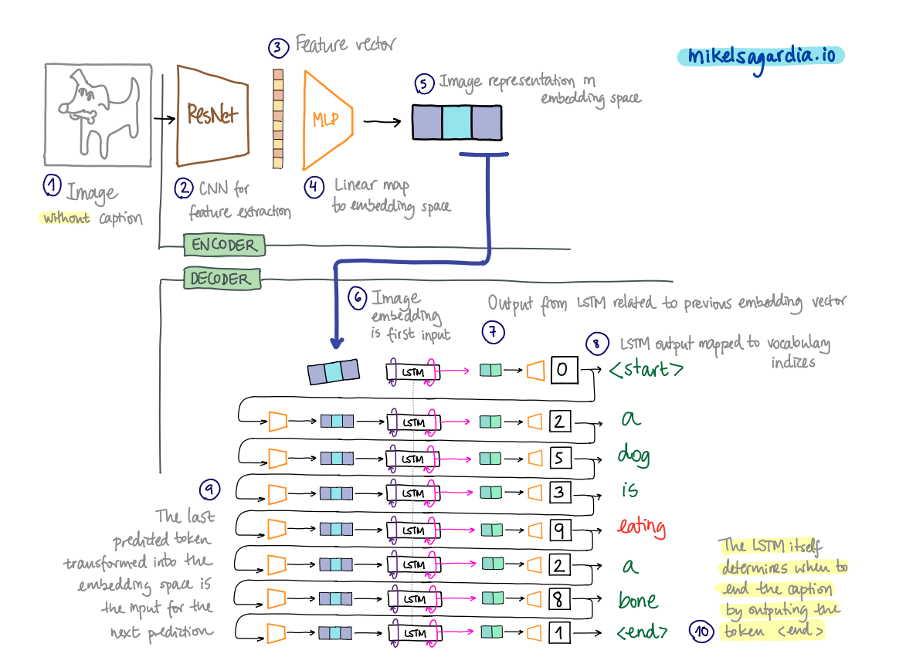

# Image Captioning Project

This repository contains an image captioning project which uses deep learning models. Given an image, first, it is processed by a Convolutional Neural Network (encoder), and second, by a Recurrent Neural Network (decoder). The decoder outputs a text caption of the content in the image. The [MS COCO](https://cocodataset.org/#home) dataset was used for training the models, which were implemented using [Pytorch](https://pytorch.org).

## Introduction

The developed encoder-decoder architecture is based on the one reported in the paper [*Show and Tell* by Vinyals et al.](https://arxiv.org/abs/1411.4555) and it uses materials from the [Udacity Computer Vision Nanodegree](https://www.udacity.com/course/computer-vision-nanodegree--nd891), available in their original form in the repository [CVND---Image-Captioning-Project](https://github.com/udacity/CVND---Image-Captioning-Project).

After approximately 10 hours of training on Google Colab the results are not perfect, but I think it's quite remarkable that such a simple decoder is able to perform as it does; the logic in the captions is not always correct, but the output sentence is often very close to what the image contains :sunglasses:

<table cellspacing="0" cellpadding="0" style="border-collapse: collapse; border: none;">
<tr >
<td style="border: none;">

<p align="center">
  
</p>

</td>
<td style="border: none;">

<p align="center">
  
</p>

</td>
</tr>
</table>

All in all, I think the repository is a good starting point to test other ideas, listed in the section [Improvements](#improvements-next-steps). Additionally, many practical contents are covered, which might be interesting to interested engineers who come from other fields:

- Installation and usage of the [MS COCO](https://cocodataset.org/#home) dataset.
- Creation of custom data loaders.
- Basic text processing (i.e., tokenization and vectorization) to create vocabularies.
- Usage of pre-trained Convolutional Neuronal Networks.
- Usage of Recurrent Neural Networks to learn sequences of vectors.
- In the links, I provide resources for:
    - How to compute the [BLEU metric](https://en.wikipedia.org/wiki/BLEU): theory and tools.
    - How to implement [beam search](https://en.wikipedia.org/wiki/Beam_search).

This document is structured as follows:

- [Image Captioning Project](#image-captioning-project)
  - [Introduction](#introduction)
  - [How to Use This](#how-to-use-this)
    - [Overview of Files and Contents](#overview-of-files-and-contents)
    - [Dependencies](#dependencies)
    - [COCO Dataset](#coco-dataset)
  - [The Encoder-Decoder Model](#the-encoder-decoder-model)
  - [Practical Notes](#practical-notes)
  - [Improvements, Next Steps](#improvements-next-steps)
    - [Notes on How to Perform Validation](#notes-on-how-to-perform-validation)
    - [Notes on Beam Search](#notes-on-beam-search)
  - [Interesting Links](#interesting-links)
  - [Authorship](#authorship)

## How to Use This

First, you need to install the [dependencies](#dependencies) and set up the [COCO dataset](#coco-dataset); then, you can open and run the notebooks sequentially.

In the following sections I explain in more detail all those steps.
### Overview of Files and Contents

The project folder contains the following files:

```
.
├── 0_Dataset.ipynb         # Notebook to test the COCO dataset
├── 1_Preliminaries.ipynb   # Notebook to test the data loader
├── 2_Training.ipynb        # Notebook to train the encoder-decoder models
├── 3_Inference.ipynb       # Notebook for caption generation
├── README.md               # This file
├── data_loader.py          # Definition of the data loader for COCO
├── images/                 # Auxiliary images
├── literature/             # Links to papers
├── model.py                # Encoder-decoder definition
├── models/                 # Model weights saved during training
├── requirements.txt        # Dependencies
└── vocabulary.py           # Tokenization vocabulary definition
```

The implementation is guided by the notebooks, which either contain the necessary code or import it from different scripts (explained below).

As mentioned, first, the [dependencies](#dependencies) and the [COCO dataset](#coco-dataset) need to be installed. Assuming everything is set up, we can run the notebooks sequentially; they carry out the following tasks:

- [`0_Dataset.ipynb`](0_Dataset.ipynb)
  - The `cocoapi` for the [COCO dataset](#coco-dataset) is tested; the dataset is loaded and it is shown how to get images and captions with the API.
- [`1_Preliminaries.ipynb`](1_Preliminaries.ipynb)
  - The [`DataLoader`](https://pytorch.org/docs/master/data.html#torch.utils.data.DataLoader) class which is built using [`data_loader.py`](data_loader.py) and [`vocabulary.py`](vocabulary.py); also the code in those auxiliary scripts is explained with examples.
  - The model definition is tested (size of the output); the model itself is implemented in [`model.py`](model.py).
- [`2_Training.ipynb`](2_Training.ipynb)
  - Hyperparameters are defined following [Vinyals et al.](https://arxiv.org/abs/1411.4555).
  - The models (i.e., the encoder and the decoder) are trained and the weights persisted.
- [`3_Inference.ipynb`](3_Inference.ipynb)
  - The trained models are loaded.
  - Random images are fed first to the encoder, which produces a vector for each image.
  - Vector images are passed to the decoder, which generates a sequence of tokens that describes each image.

On the other hand, the implementation scripts and their contents are the following:

- [`data_loader.py`](data_loader.py): data loader class based on the Pytorch [`DataLoader`](https://pytorch.org/docs/master/data.html#torch.utils.data.DataLoader) and the COCO API.
  - A dataset is built using the COCO API.
  - Images are loaded and returned as tensors.
  - Captions are processed to build a vocabulary (see next file); then, captions are returned as tensors of indices.
  - The data loader makes possible to yield batches of image-captions
  - We get the data loader via `get_loader()` and we can pass a `transform` to it
  - Once we've found a correct `vocab_threshold` (see below), we should use the option `vocab_from_file=True`, because the persisted vocabulary is loaded.
  - Note: the index we insert to the COCO dataset is not the image index, but the annotation index; then, the image id of that annotation is found, and with it the image. Thus, we end up having the same image every 5 captions. However, not that the caption ids of the same image don't need not be consecutive!
- [`vocabulary.py`](vocabulary.py): vocabulary class based on NLTK.
  - All captions are read and tokenized with NLTK.
  - A vocabulary word is created (with associated index) if the word appears more than `vocab_threshold` times.
  - The vocabulary is stored in a dictionary: `word2idx`.
  - The vocabulary object is a callable that returns the index of a token/word in it.
  - We have the special tokens `<star>` (index 0), `<end>` (index 1) and `<unk>` (index 2); all captions are wrapped with 0/1 indices and unknown words have the index 2.
  - Building the vocabulary takes some minutes.
  - The built vocabulary is persisted as a pickle.
  - Once we've found a correct `vocab_threshold`, we should use the option `vocab_from_file=True`, because the persisted vocabulary is loaded.
- [`model.py`](model.py): definition of the `EncoderCNN` and the `DecoderRNN`.
  - `EncoderCNN`: frozen ResNet50 from which its classifier is replace by a new fully connected layer that maps feature vectors into vectors of the size of the word embedding.
  - `DecoderRNN`: architecture based in the one from [Vinyals et al.](https://arxiv.org/abs/1411.4555). It consists in an [LSTM](https://en.wikipedia.org/wiki/Long_short-term_memory) layer which takes the caption sequence with the transformed image at the front. The output is a sequence of hidden states of the same length; the hidden states are mapped to the vocabulary space so that each sequence element predicts the likelihood of any word in the vocabulary.
  - The decoder has an inference function called `sample()`; this functions takes a pre-processed image vector and passes it to the trained LSTM unit. Then, the LSTM unit returns an output which is mapped to the vocabulary space. We use a greedy approach which consists in selecting one of the most probable words in the vocabulary vector; the first token will most probably be `<start>`. Then, the LSTM output is passed in a loop again to the LSTM to obtain the next token. The loop is run to get step by step all the tokens that build the caption until the output token is `<end>` -- then we stop. This simple approach could be improved using [beam search](#notes-on-beam-search).

### Dependencies

You should create a python environment (e.g., with [conda](https://docs.conda.io/en/latest/)) and install the dependencies listed in the [requirements.txt](requirements.txt) file.

A short summary of commands required to have all in place is the following:

```bash
conda create -n img-capt python=3.6
conda activate img-capt
conda install pytorch torchvision -c pytorch
conda install -c anaconda scikit-image
conda install pip
pip install -r requirements.txt
```

### COCO Dataset

```bash
# Clone the COCO-API package and build it
cd ~/git_repositories
git clone https://github.com/cocodataset/cocoapi.git  
cd cocoapi/PythonAPI
conda activate img-capt
make 
cd ..
# IMPORTANT:
# You might need to include this path/line to your code:
# sys.path.append('~/git_repositories/cocoapi/PythonAPI')
#
# Now, download the dataset
# and place it in the cocoapi repo folder. 
# Follow the instructions below!
```

The COCO dataset can be downloaded from [https://cocodataset.org/#download](https://cocodataset.org/#download). I used all the images and annotations of the 2014 dataset, which are linked below:

- [Train 2014 Images](http://images.cocodataset.org/zips/train2014.zip)
- [Valid 2014 Images](http://images.cocodataset.org/zips/val2014.zip)
- [Test 2014 Images](http://images.cocodataset.org/zips/test2014.zip)
- [Train/Valid 2014 Annotations](http://images.cocodataset.org/annotations/annotations_trainval2014.zip)
- [Test 2014 Annotations](http://images.cocodataset.org/annotations/image_info_test2014.zip)

:warning: Note that the dataset weights more than 20 GB.

The images and annotations need to be extracted to the `cocoapi` repository folder we created, to the folders `cocoapi/annotations` and `cocoapi/images`. The final structure is the following:

```
.
├── PythonAPI
├── annotations/
│   ├── captions_train2014.json
│   ├── captions_val2014.json
│   ├── image_info_test2014.json
│   ├── instances_train2014.json
│   ├── instances_val2014.json
│   ├── person_keypoints_train2014.json
│   └── person_keypoints_val2014.json
├── images/
│   ├── train2014/
│   │   ├── ...
│   ├── val2014/
│   │   ├── ...
│   └── test2014/
│   │   ├── ...
├── ...
```

## The Encoder-Decoder Model

If feel you're a bit lost, you can have a look at my [text generator project](https://mikelsagardia.io/blog/text-generation-rnn.html) or [sentiment analysis method collection](https://github.com/mxagar/text_sentiment); in them, I explain the most basic concepts upon which the current image captioning project is built.

The model from this project consists of two networks: the encoder and the decoder. I have implemented them as described in the great paper [Show and Tell](https://arxiv.org/abs/1411.4555) by Vinyals et al. Even though the networks are defined separately, their weights are trained together in the optimizer.

One central idea in the approach is that both images and caption tokens are transformed into the same [embedding space](https://en.wikipedia.org/wiki/Embedding). Then, these image and token embedding vectors are passed to a [Long Short-Term Memory (LSTM)](https://en.wikipedia.org/wiki/Long_short-term_memory) unit to generate hidden state vectors; and finally, these hidden state vectors are mapped to the vocabulary index space.

To better understand the complete workflow, let's consider the two regimes of the model separately: (*i*) **training** and (*ii*) **inference**.

As shown in the figure below, during **training**, we take image-caption pairs. The *encoder* converts the image to a feature vector using a pre-trained [ResNet50](https://en.wikipedia.org/wiki/Residual_neural_network) [Convolutional Neural Network (CNN)](https://en.wikipedia.org/wiki/Convolutional_neural_network), and then, that feature vector is transformed into an [embedding space](https://en.wikipedia.org/wiki/Embedding) using a fully connected layer.



The *decoder* takes the tokenized caption converted into vocabulary indices and transforms that sequence into embedding vectors. Note that the caption will be wrapped by the spacial tokens `<start>` and `<end>`. The image embedding vector is pushed to the front of the caption sequence and the last caption token vector is popped from the tail. The resulting sequence of vectors is fed to the LSTM, which outputs another sequence of vectors -- these are the so called hidden state vectors. Those hidden state vectors are then mapped to the vocabulary index space and we obtain a new sequence of tokens. The model loss is computed with that output: we optimize both the encoder and the decoder so that the input caption and the output sequence of tokens is the same. Note that during that process all the weights are modified except the ones of the CNN feature extractor, i.e., the ResNet50.

During **inference**, we have only an image; the goal is to generate a meaning caption for it. In that process, the *encoder* carries out the same task as before: the image is converted into an embedding vector, as shown in the next figure.



On the other hand, the *decoder* works differently: it receives only the image embedding vector and it outputs one hidden state. Then, that hidden state vector is mapped to the vocabulary space, which results in the first token of the caption. Next, that token is transformed into the embedding space and fed to the LSTM; the process repeats in a loop while we generate all the caption tokens one after the other.

Note that 

- the decoder should learn to yield the token `<start>` as the first output,
- the LSTM cell retains its long-term memory from step to step, which contains the image representation,
- the LSTM determines on its own when to finish the caption by yielding the token `<end>`,
- currently, a greedy selection of the most probable tokens is done during inference, but more sophisticated approaches can be implemented, such as [beam search](#notes-on-beam-search).

## Practical Notes

Working with sequences and RNNs can seem non-straighforward. In this section I collect some remarks that can be helpful. They are useful only if the reader knows already how LSTMs are used in general; if that's not the case [my blog post on text generation](https://mikelsagardia.io/blog/text-generation-rnn.html) provides many introductory explanations.

- LSTM units are defined with `nn.LSTM` in Pytorch, and although they are called *units*, they are more like a layer than a neuron, akin to `nn.RNN`; its equivalent would be `nn.Linear`. Additionally, `nn.LSTM` can have several stacked layers inside; if they are more than 1, we can even add dropout in their definition.
- Note that the `batch_size` and the `sequence_length` are really **not LSTM model attributes**; that means we can dynamically change these sizes every time we perform `forward()`, in other words, we can simply pass an input vector 
- We can pass one vector after the another in a loop. However, it's more efficient to pass a sequence of vectors together in a tensor. On top of a sequence, we can define batches of sequences. While sequences are usually defined by the application programmer, I'd advise to create batches automatically with the [Pytorch `DataLoader`](https://pytorch.org/docs/stable/data.html) API, as shown in the projects [text_generator](https://github.com/mxagar/text_generator) or [image_captioning](https://github.com/mxagar/image_captioning).
- When we pass a sequence to the `LSTM` unit:
  - The returned hidden state tuple `hidden = (h, c)` refers to the one obtained after passing the last vector in the sequence; `h` and `c` have the same size `hidden_size`, `h` is the output or short-term memory and `c` is the cell state or long-term memory.
  - We get as output a sequence of the same length; the output sequence is composed of hidden memory state vectors `h` obtained after each input sequence element. The size of a hidden state vector doesn't need to be the same as the size of an input vector. This can be seen in the project [text_generator](https://github.com/mxagar/text_generator), too; if you'd like more explanations, I encourage you to read [my blog post on that project](https://mikelsagardia.io/blog/text-generation-rnn.html).
- In some cases we may want to pass input vectors in a loop; for instance, that's the case when the input sequence would be composed by the subsequent outputs of the previous vector inputs, like in machine translation or [image caption generation](https://github.com/mxagar/image_captioning).
- We decide whether to pass the `hidden` tuple or not depending on the application:
  - If we don't pass `hidden`, the hidden states are initialized to zero according to the [Pytorch LSTM documentation](https://pytorch.org/docs/stable/generated/torch.nn.LSTM.html).
  - I understand that if we define `hidden = None` and then do `output, hidden = lstm(inputs, hidden)`, that's like passing nothing.
  - If we write an `init_hidden()` function to manually reset/initialize the hidden state tuple, we need to take into account that it requires the parameters `batch_size` and `sequence_length`, which should be able to modify any time.
  - When we input a sequence, the `h` vector is passed between element processings automatically, independently from the fact whether we pass the `hidden` tuple or not.
  - If we want to re-use the previous `hidden` tuple, you need to consider the following:
    - The sequence inputs that reuse `hidden` *need* to be related in each loop step.
    - In the training loop, we might want to create a new copy `hidden` to prevent backpropagating the entire training history: `hidden = tuple([each.data for each in hidden])`
    - Important links on resetting hidden states:
      - [In LSTM, why should I reset hidden variables?](https://discuss.pytorch.org/t/in-lstm-why-should-i-reset-hidden-variables/94016)
      - [Shall I pass hidden states to LSTM or not?](https://discuss.pytorch.org/t/shall-i-pass-hidden-states-to-lstm-or-not/72426)
- Observation I've done from several NLP projects: when the LSTM output is mapped to a vocabulary vector (in theory a sparse one-hot encoded vector) with a linear layer, the model output is not activated with `softmax`; instead, it is left as a non-activated (regression) output and it is passed to the regular `CrossEntropyLoss` criterion/loss function (yes, `CrossEntropyLoss`). Then, that loss function compares integer-encoded tokens with regressed vocabulary values -- it doesn't make much sense, but there seems to be some magic implemented under the hood that makes the models learn more efficiently.
- RNNs have many hyperparameters and it can be overwhelming to select the correct starting set.
  - [Andrej Karpathy](http://karpathy.github.io/2015/05/21/rnn-effectiveness/) gives a great collection of hints in his project [char-rnn](https://github.com/karpathy/char-rnn); these are implemented in my [text generator project](https://github.com/mxagar/text_generator).
  - Also, related research papers give good starting points.

## Improvements, Next Steps

- [ ] Encoder: try other frozen/pre-trained backbones (e.g., [Inception-V3](https://pytorch.org/hub/pytorch_vision_inception_v3/)) as feature extractors. See related [blog post Google AI](https://ai.googleblog.com/2016/09/show-and-tell-image-captioning-open.html).
- [ ] Encoder: add batch normalization after the feature extractor.
- [ ] Perform **validation**. See below the section on [validation](#notes-on-how-to-perform-validation).
- [ ] Implement **beam search** to sample the tokens of predicted sentence, as in [Show and Tell, by Vinyals et al.](https://arxiv.org/abs/1411.4555). See the section on [beam search](#notes-on-beam-search) below.
- [ ] Explore the limits of the application to see where breakpoint is:
  - [ ] Try smaller networks: ResNet18, MobileNet, ShuffleNet, EfficientNet, DenseNet.
  - [ ] Try smaller capacities: `embed_size` or `hidden_size` of values `64-128`.
  - [ ] Which is the importance of `vocab_threshold`?
- [ ] Evaluate the model with [BLEU](https://aclanthology.org/P02-1040.pdf).
- [ ] Try a more extensive data augmentation, e.g., `RandomVerticalFlip`; it has been shown that data augmentation improves considerably the model performance in image caption generation applications: [Aldabbas et al.](https://www.semanticscholar.org/paper/Data-Augmentation-to-Stabilize-Image-Caption-Models-Aldabbas-Asad/12956b76523678080c5b9f35ffc6fbb456550737)
- [ ] Try other optimizers. Adam is good to avoid local optima and it adjusts the learning rate automatically; however, training only for 3 epochs probably is not enough to see the advantages. See the paper links below.
- [ ] Implement attention mechanisms, for instance after [Show, Attend and Tell, by Xue et al.](https://arxiv.org/abs/1502.03044)


### Notes on How to Perform Validation

Quick recipe to implement validation: 

1. Implement in the `get_loader()` function from `data_loadder.py` the following condition:

```python
    if mode == 'val':
        if vocab_from_file==True: 
            assert os.path.exists(vocab_file), "vocab_file does not exist. Set vocab_from_file=False"
        img_folder = os.path.join(cocoapi_loc, 'cocoapi/images/val2014/')
        annotations_file = os.path.join(cocoapi_loc, 'cocoapi/annotations/captions_val2014.json')
```

2. Use [`pycocoevalcap`](https://github.com/salaniz/pycocoevalcap) to compute the metrics, e.g., BLEU. Usage example: [coco_eval_example.py](https://github.com/salaniz/pycocoevalcap/blob/master/example/coco_eval_example.py).

### Notes on Beam Search

Given a `beam_width`, every time step, the algorithm selects `beam_width` of best alternatives with the highest probability as the most likely possible choices. Example with `beam_width = 3`:

- 1. Find the top 3 words with the highest probability given the input sentence.
- 2. Find the three best pairs for the first and second words based on the conditional probability.
- 3. Find the three best pairs for the first, second and third word based on the input sentence and the chosen first and the second word.

Check these links:

- [Foundations of NLP Explained Visually: Beam Search, How It Works](https://towardsdatascience.com/foundations-of-nlp-explained-visually-beam-search-how-it-works-1586b9849a24)
- Example implementation: [beam.py](https://github.com/mbarnes1/beam_search/blob/master/beam.py)

## Interesting Links

- [My notes and code](https://github.com/mxagar/computer_vision_udacity) on the [Udacity Computer Vision Nanodegree](https://www.udacity.com/course/computer-vision-nanodegree--nd891).
- [My notes and code](https://github.com/mxagar/deep_learning_udacity) on the [Udacity Deep Learning Nanodegree](https://www.udacity.com/course/deep-learning-nanodegree--nd101).
- [Pytorch: Writing Custom Datasets, DataLoaders and Transforms](https://pytorch.org/tutorials/beginner/data_loading_tutorial.html)
- [A Tutorial on Image Captioning / Implementation of Show, Attend and Tell](https://github.com/sgrvinod/a-PyTorch-Tutorial-to-Image-Captioning)
- [Implementation of Show, Attend and Tell](https://github.com/minfengUCAS/show-attend-tell)
- [Report on the Implementation of Show and Tell](https://cs224d.stanford.edu/reports/msoh.pdf)
- [Foundations of NLP Explained Visually: Beam Search, How It Works](https://towardsdatascience.com/foundations-of-nlp-explained-visually-beam-search-how-it-works-1586b9849a24)
- Tools for NLP evaluation metrics applied to the COCO dataset: [`pycocoevalcap`](https://github.com/salaniz/pycocoevalcap)

**Papers**: look in the folder [literature](literature/literature.txt):

- [Show and Tell: A Neural Image Caption Generator, Vinyals et al.](https://arxiv.org/abs/1411.4555)
- [Show, Attend and Tell: Neural Image Caption Generation with Visual Attention, Xu et al.](https://arxiv.org/abs/1502.03044)
- [VQA: Visual Question Answering, Agrawal et al.](https://arxiv.org/abs/1505.00468v7)
- [Rich Image Captioning in the Wild, Tran et al.](https://arxiv.org/abs/1603.09016)
- [Image Captioning and Visual Question Answering Based on Attributes and External Knowledge, Wu et al.](https://arxiv.org/abs/1603.02814)
- [Intention Oriented Image Captions with Guiding Objects, Zheng et al.](https://arxiv.org/abs/1811.07662)
- [Object Counts! Bringing Explicit Detections Back into Image Captioning, Wang et al.](https://arxiv.org/abs/1805.00314)
- [A Multi-task Learning Approach for Image Captioning, Zhao et al.](https://www.ijcai.org/Proceedings/2018/168)
- [Counterfactual Visual Explanations, Goyal et al.](https://arxiv.org/abs/1904.07451)
- [BLEU: a Method for Automatic Evaluation of Machine Translation, Papineni et al.](https://aclanthology.org/P02-1040.pdf)
- [Data Augmentation to Stabilize Image Caption Generation Models in Deep Learning, Aldabbas et al.](https://www.semanticscholar.org/paper/Data-Augmentation-to-Stabilize-Image-Caption-Models-Aldabbas-Asad/12956b76523678080c5b9f35ffc6fbb456550737)
- [Descending through a Crowded Valley - Benchmarking Deep Learning Optimizers, Schmidt et al.](https://arxiv.org/abs/2007.01547)
- [An overview of gradient descent optimization algorithms, Ruder](https://arxiv.org/pdf/1609.04747.pdf)

## Authorship

Mikel Sagardia, 2022.  
No guarantees.

You are free to use this project, but please link it back to the original source.
